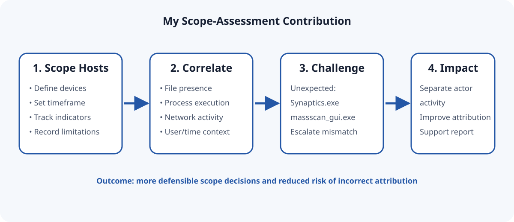
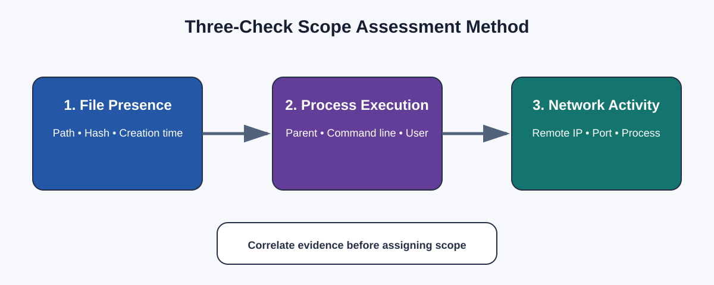
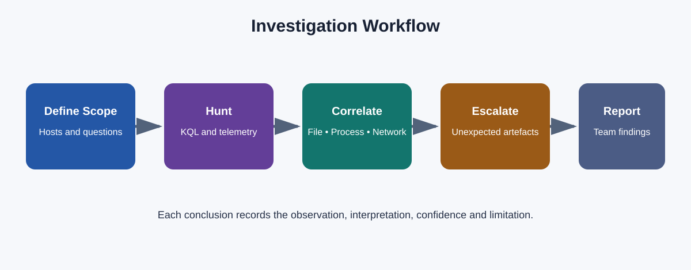
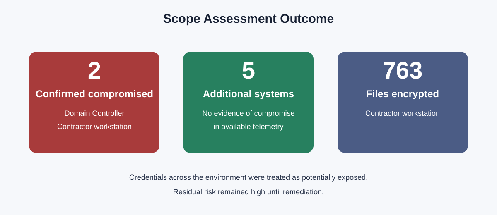
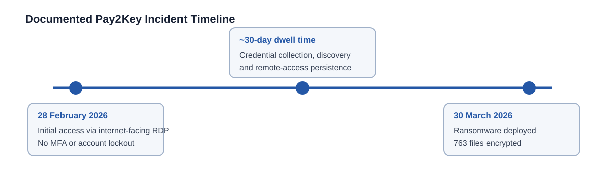

# My Scope Assessment Contribution: Pay2Key Ransomware Investigation

## Graham McKean — Junior SOC Analyst Portfolio Case Study

[](#my-role-and-responsibility)
[](#tools-i-used)
[](#queries-supporting-my-workstream)
[](#investigation-context)

> **[View my HTML portfolio page](docs/index.html)**  
> **[Open the client-ready incident report](reports/IR-2026-001_Pay2Key_Draft_v0.9.pdf)**


## Project Overview
This portfolio project demonstrates my contribution as Scope Assessment Analyst during a collaborative Digital Forensics and Incident Response (DFIR) investigation based on a real-world Pay2Key ransomware incident.

The investigation was conducted as part of a structured SOC/DFIR training exercise using a historical incident dataset. Although the investigation began approximately 30 days after the initial compromise, this reflects the design of the exercise rather than a live response. The delayed investigation enabled analysts to work from a complete evidence set, replicate real-world forensic workflows, and produce a professional Incident Response report while applying industry-standard investigative techniques.

My focus was to determine the scope of compromise, validate affected and unaffected hosts using endpoint, process and network evidence, and contribute findings that were incorporated into the final client-ready Incident Response report.

## Contribution at a Glance

| My responsibility | What I did | Why it mattered |
|---|---|---|
| Establish incident scope | Assessed hosts using file, process and network evidence | Produced defensible compromised/not-observed decisions rather than relying on one alert |
| Validate findings | Correlated evidence across Microsoft Defender XDR telemetry | Reduced the risk of false conclusions and unsupported assumptions |
| Investigate unexpected results | Flagged `Synaptics.exe` and `massscan_gui.exe` on the contractor workstation | Helped the team separate additional actor activity from Pay2Key |
| Communicate conclusions | Documented scope findings, limitations and escalation points | Enabled my findings to be incorporated into the final incident report |



## My Role and Responsibility

As **Scope Assessment Analyst**, I used a three-check methodology for each relevant host:

1. **File presence** — Was a suspicious artefact present on disk?
2. **Process execution** — Did it execute, and under which user/process context?
3. **Network communication** — Did the host or process communicate with suspicious infrastructure?



This approach allowed me to distinguish between:

- confirmed malicious activity;
- artefact presence without confirmed execution;
- activity requiring escalation or attribution review; and
- systems with no evidence of compromise in the available telemetry.

I recorded the supporting evidence and limitations for each conclusion. I did not treat “no evidence found” as proof that compromise was impossible.

## My Standout Finding

While reviewing the scope results, I independently identified `Synaptics.exe` and `massscan_gui.exe` on the contractor workstation. These artefacts were outside the expected Pay2Key pattern and were not part of my original assigned search focus.

I escalated them because they could not safely be attributed to the ransomware actor without further correlation. This contributed to the team separating additional actor activity and avoided incorrectly merging DarkKomet-related behaviour into the Pay2Key attribution.

**Analytical value demonstrated:**

- reading query output beyond the expected indicators;
- recognising anomalies that did not fit the working hypothesis;
- maintaining attribution discipline;
- escalating material findings clearly; and
- understanding how one incorrect assumption can affect an entire incident narrative.

## My Scope-Assessment Workflow



My workflow was:

1. Define relevant devices, timeframe and indicators.
2. Search for suspicious file presence.
3. Confirm process execution and user/process context.
4. Correlate associated network communication.
5. Compare timestamps and behaviour across hosts.
6. Record evidence, uncertainty and scope status.
7. Escalate unexpected artefacts for attribution review.
8. Provide concise findings for the final report.

## Queries Supporting My Workstream

The supplied client-ready report does not include the original technical appendices, raw telemetry or original case queries. The files below are therefore **portfolio reconstructions** showing how my documented three-check methodology can be implemented in Microsoft Defender XDR Advanced Hunting. They are not presented as verbatim evidence from the case.

| Query | How it supports my contribution |
|---|---|
| [01 — File-presence hunt](queries/01-file-presence-hunt.kql) | Identifies whether suspicious artefacts exist across candidate hosts |
| [02 — Process-execution validation](queries/02-process-execution-validation.kql) | Confirms execution and captures account, command-line and parent-process context |
| [03 — Network correlation](queries/03-network-correlation.kql) | Tests whether suspicious processes communicated externally |
| [04 — Host scope matrix](queries/04-host-scope-matrix.kql) | Combines the three checks into a host-by-host assessment view |
| [Query notes and limitations](queries/README.md) | Explains reconstruction status, assumptions and safe use |

```kusto
let SuspiciousFiles = dynamic(["Synaptics.exe", "massscan_gui.exe"]);
DeviceProcessEvents
| where FileName in~ (SuspiciousFiles)
| project Timestamp, DeviceName, AccountName, FileName,
          ProcessCommandLine, InitiatingProcessFileName, SHA256
| order by Timestamp asc
```

## Evidence of My Work

### Documented contribution

The accompanying team review describes my scope assessment as methodical and specifically recognises the three-source validation approach. It also credits my independent identification of `Synaptics.exe` and `massscan_gui.exe` with supporting separation of additional actor activity.

### Evidence included in this repository

- [Client-ready incident report](reports/client-ready-incident-response-report.pdf)
- [Portfolio summary highlighting my contribution](reports/client-ready-summary.md)
- [Scope decision template](evidence/scope-matrix-template.csv)
- [Evidence register template](evidence/evidence-register-template.csv)
- [Rendered report pages](images/report-evidence/)
- [Documented methodology diagrams](images/)

The report-page images are genuine images of the supplied client-ready report. The diagrams are derived from the documented investigation and my role; they are not fabricated screenshots of Defender telemetry.

## Outcomes of My Contribution

- Supported confirmation that the **Domain Controller** and **contractor workstation** were compromised.
- Supported assessment that five additional systems showed **no evidence of compromise in the available telemetry**.
- Applied a repeatable three-source method to make scope conclusions more defensible.
- Identified unexpected artefacts that materially improved attribution accuracy.
- Helped prevent unrelated activity from being incorrectly attributed to Pay2Key.
- Contributed findings that were incorporated into the final collaborative report.



## Challenges I Addressed

### Avoiding single-source conclusions
A file may exist without executing, and a process may run without producing obvious network activity. I therefore correlated all three evidence types before reaching a scope decision.

### Handling negative findings responsibly
Five systems showed no evidence of compromise, but available telemetry cannot prove that activity never occurred. I learned to state the evidence boundary clearly instead of describing a host as unconditionally “clean.”

### Separating overlapping actor activity
Unexpected artefacts on an already compromised workstation could easily have been folded into the main ransomware narrative. I treated the mismatch as an attribution problem and escalated it.

### Translating analysis into clear reporting
My analytical work needed to stand on its own for reviewers who were not present during the investigation. This reinforced the importance of query descriptions, evidence references, formatting and concise conclusions.

## Lessons Learned

- Scope decisions are strongest when file, process and network evidence agree.
- Query results must be read for anomalies, not only for expected indicators.
- “No evidence observed” is more accurate than claiming a system is definitively clean.
- Attribution requires timestamp, host, account, process and network context.
- A junior analyst can materially improve an investigation by escalating findings that do not fit.
- Clear writing and evidence traceability are part of the technical work, not an afterthought.

## Tools I Used

| Tool / technology | How I applied it |
|---|---|
| Microsoft Defender XDR | Advanced Hunting and endpoint investigation workflow |
| Microsoft Defender for Endpoint | File, process, device and network telemetry |
| Kusto Query Language (KQL) | Host-level searching, correlation and scope validation |
| MITRE ATT&CK | Behaviour and technique context |
| Evidence registers / scope matrices | Tracking evidence, decisions and limitations |
| Markdown, HTML and SVG | Communicating my analysis professionally |

## Investigation Context

This was a **collaborative simulated investigation**, not a solo project. The wider case involved Pay2Key ransomware, internet-facing RDP, approximately 30 days of undetected access, two compromised systems and 763 encrypted files. Other analysts covered initial access, persistence, network/C2 analysis and malware-related work.

That wider context is included only to explain where my scope-assessment work fitted. I do not claim ownership of findings produced by the IR Lead or other analysts.



## Repository Structure

```text
pay2key-scope-assessment/
├── README.md
├── docs/index.html
├── reports/
│   ├── client-ready-incident-response-report.pdf
│   └── client-ready-summary.md
├── images/
│   ├── contribution-impact.svg
│   ├── three-check-method.svg
│   ├── investigation-workflow.svg
│   ├── scope-outcome.svg
│   ├── attack-timeline.svg
│   └── report-evidence/client-report-page-1.png ... page-4.png
├── queries/
│   ├── 01-file-presence-hunt.kql
│   ├── 02-process-execution-validation.kql
│   ├── 03-network-correlation.kql
│   ├── 04-host-scope-matrix.kql
│   └── README.md
└── evidence/
    ├── evidence-register-template.csv
    └── scope-matrix-template.csv
```

## Interview Summary

> As Scope Assessment Analyst in a collaborative Pay2Key ransomware investigation, I assessed hosts using file-presence, process-execution and network-communication evidence in Microsoft Defender XDR. While reviewing the results, I independently identified unexpected artefacts that did not fit the Pay2Key pattern. Escalating those findings helped the team separate additional actor activity and protected the accuracy of the final attribution. My scope conclusions and supporting evidence contributed to the final client-ready incident response report.

## Ethics and Disclosure

- This portfolio is based on a simulated collaborative investigation.
- My individual contribution is distinguished from wider team findings.
- Report images reproduce the supplied client-ready report.
- KQL files are labelled reconstructions because original telemetry and technical appendices were not supplied.
- No credentials, personal data, confidential infrastructure or fabricated telemetry are included.

## Author

**Graham McKean**  
Junior SOC Analyst candidate | SOC Analysis | DFIR | Threat Hunting | Incident Response
