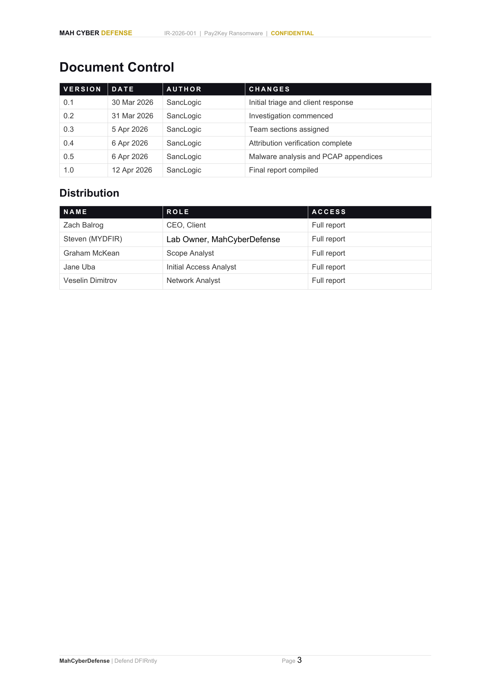
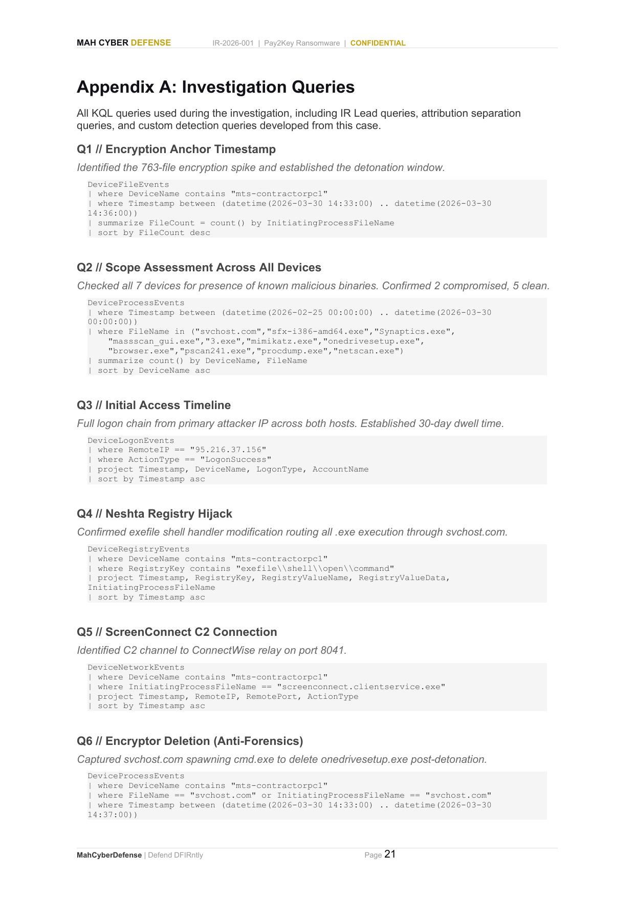
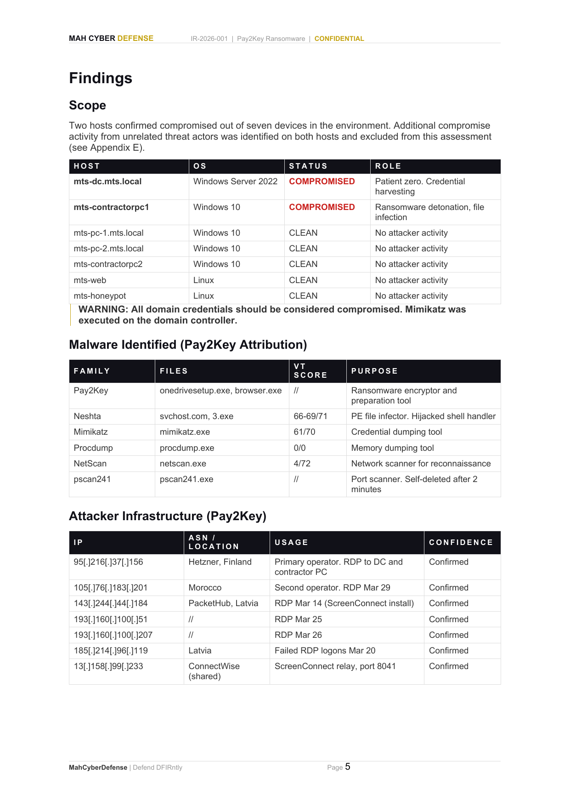
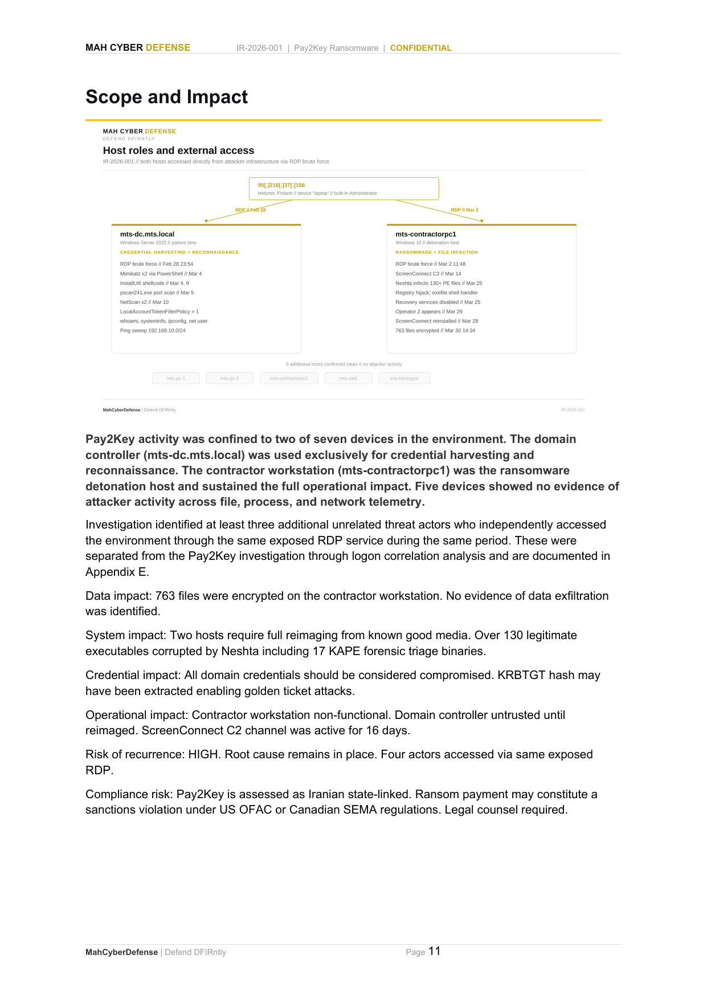
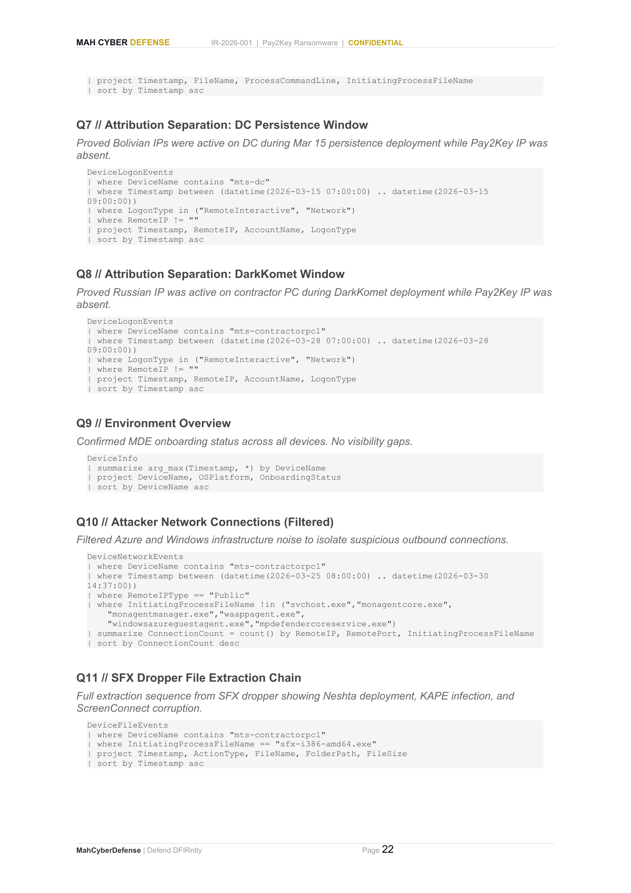
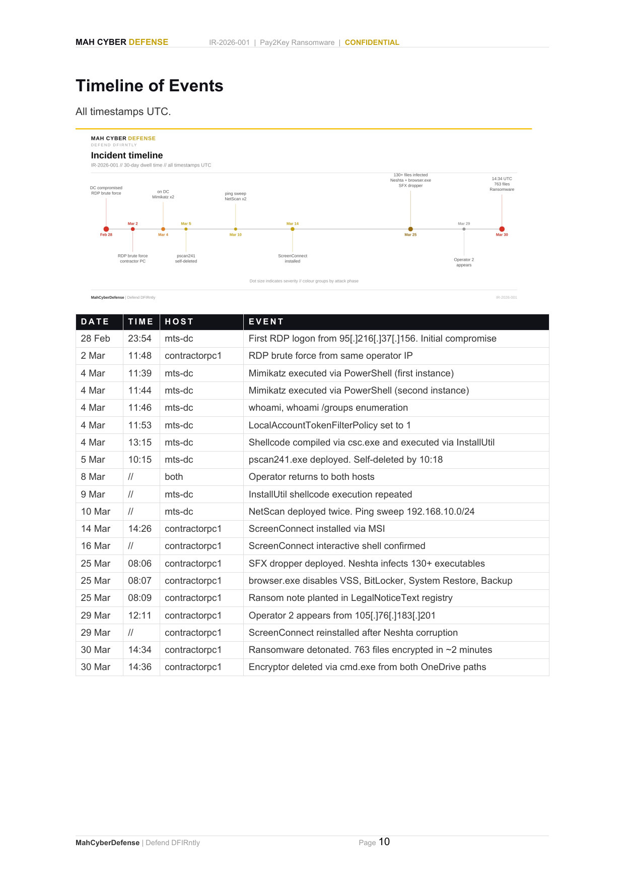
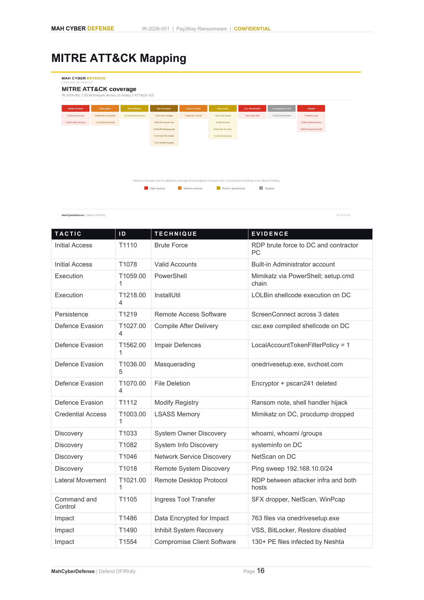

# Scope Assessment Case Study - Pay2Key Ransomware

## My contribution to a collaborative DFIR investigation

**Analyst:** Graham McKean  
**Role:** Scope Assessment Analyst  
**Environment:** Microsoft Defender for Endpoint / Microsoft Defender XDR  
**Core skills:** KQL, incident scoping, threat hunting, evidence correlation, attribution discipline

[View the portfolio website](https://grhmmckean33.github.io/pay2key-scope-assessment/) | [Open the final team report](reports/IR-2026-001-Pay2Key-Final-Report.pdf)


## Project context

This case study presents my individual contribution to a collaborative investigation based on a real-world Pay2Key ransomware scenario. It was completed as a structured SOC/DFIR training exercise using historical Microsoft Defender for Endpoint telemetry. Although the evidence covered a 30-day intrusion period, the work was not a delayed live response: the historical dataset was intentionally investigated after the event so analysts could reconstruct the full attack, validate findings and produce a professional incident-response report.

The final report lists me as the **Scope Analyst** and records that the team investigated seven devices, ultimately confirming two compromised hosts and five with no evidence of attacker activity.



## My objective

My assigned objective was to determine the extent of compromise across the environment and provide defensible evidence for each host classification. I needed to answer three questions:

1. Which systems contained known malicious artefacts?
2. Which artefacts had actually executed or communicated externally?
3. Did unexpected activity belong to Pay2Key or to a separate actor?

## My investigation method

I used a multi-source validation approach rather than relying on a single indicator:

- **Process evidence** - execution of known malicious binaries across all seven devices.
- **File evidence** - presence and creation of suspicious payloads and supporting artefacts.
- **Network evidence** - communications to attacker or remote-access infrastructure.
- **Logon correlation** - matching activity windows to the remote operator present at the time.
- **Environment validation** - confirming MDE onboarding status before treating a lack of hits as meaningful.

This approach allowed me to distinguish a supported finding from an assumption and to document important visibility limitations.

## Primary query: all-device scope assessment

The key query searched all seven devices for execution of known malicious binaries and summarised results by device and filename. It supported the conclusion that two devices were compromised and five had no attacker activity.

[Open Q2 as KQL](queries/Q2-Scope-Assessment-Across-All-Devices.kql)

```kusto
DeviceProcessEvents
| where Timestamp between (datetime(2026-02-25 00:00:00) .. datetime(2026-03-30 00:00:00))
| where FileName in ("svchost.com","sfx-i386-amd64.exe","Synaptics.exe",
  "massscan_gui.exe","3.exe","mimikatz.exe","onedrivesetup.exe",
  "browser.exe","pscan241.exe","procdump.exe","netscan.exe")
| summarize EventCount=count() by DeviceName, FileName
| sort by DeviceName asc
```



## My key findings and impact

### 1. Confirmed the true scope

My assessment supported the classification of:

| Host outcome | Result |
|---|---:|
| Confirmed compromised | 2 |
| No evidence of attacker activity | 5 |
| Total assessed | 7 |

The domain controller was used for credential harvesting and reconnaissance, while the contractor workstation was the ransomware detonation and file-infection host.



### 2. Flagged unexpected artefacts

While reviewing query results, I independently flagged `Synaptics.exe` and `massscan_gui.exe`, even though they were outside the artefacts I had initially been assigned to find. This prompted follow-on attribution analysis.

### 3. Protected attribution accuracy

The unexpected artefacts were associated with separate DarkKomet activity rather than the Pay2Key intrusion. Flagging them helped the team separate Actor 3 and reduced the risk of incorrectly attributing all malicious activity to one threat actor.

[Open the DarkKomet validation query](queries/Q15-DarkKomet-C2-Actor-3.kql)

### 4. Supported the final report narrative

My scope results fed directly into the report's Findings and Scope and Impact sections, including the conclusion that five devices showed no evidence of activity across file, process and network telemetry.



## Supporting queries

| Query | Why it mattered to my workstream |
|---|---|
| [Q2 - Scope Assessment](queries/Q2-Scope-Assessment-Across-All-Devices.kql) | Identified malicious executions across all devices. |
| [Q9 - Environment Overview](queries/Q9-Environment-Overview.kql) | Confirmed telemetry coverage before drawing conclusions from negative results. |
| [Q10 - Network Connections](queries/Q10-Attacker-Network-Connections.kql) | Reduced common infrastructure noise and highlighted suspicious outbound activity. |
| [Q13 - Cross-Host Timeline](queries/Q13-Cross-Host-Malicious-Process-Timeline.kql) | Correlated execution across the two compromised hosts. |
| [Q15 - DarkKomet C2](queries/Q15-DarkKomet-C2-Actor-3.kql) | Validated the separate callback connected to Actor 3. |



## Wider incident context

The team reconstructed a 30-day intrusion beginning with internet-facing RDP, followed by credential theft, reconnaissance, remote-access tooling, recovery disablement and ransomware deployment. The contractor workstation had 763 files encrypted in approximately two minutes. This context is included only to explain where my scope work fitted into the wider investigation.



## Challenges and lessons learned

### Challenges

- **Proving a host was clean:** a query returning no results is not enough unless telemetry coverage and the relevant time window are first validated.
- **Separating concurrent actors:** suspicious artefacts could not automatically be attributed to Pay2Key; timestamps, logons, processes and network activity had to be correlated.
- **Avoiding confirmation bias:** the unexpected DarkKomet artefacts were found by reviewing what the data actually returned rather than searching only for expected Pay2Key indicators.
- **Communicating findings clearly:** strong analysis still needs a concise, reproducible write-up that another analyst can independently follow.

### Lessons learned

- Use multiple evidence sources before assigning a host status.
- Treat unexpected results as investigation leads, not noise.
- Validate visibility before using absence of evidence as support.
- Keep attribution separate from the initial compromise assessment.
- Explain the investigative purpose and outcome of each query, not just its syntax.

## Skills demonstrated

- Microsoft Defender XDR / Defender for Endpoint
- Kusto Query Language and Advanced Hunting
- Incident scope assessment
- Endpoint and network evidence correlation
- Threat hunting and IOC validation
- Threat-actor attribution discipline
- MITRE ATT&CK interpretation
- Collaborative incident-response reporting



## Evidence and limitations

The screenshots in this repository are extracted from the final collaborative report and the KQL files are reproduced from its investigation-query appendix. The report notes that the assessment depended on available MDE telemetry and that activity outside endpoint visibility, including potential transfer through encrypted RDP sessions, could not be completely ruled out.

## Repository structure

```text
docs/index.html                         GitHub Pages portfolio
images/report-evidence/                 Selected final-report evidence
queries/                                KQL used to explain my workstream
reports/IR-2026-001-Pay2Key-Final-Report.pdf
README.md
```

## Interview summary

> As the Scope Assessment Analyst, I assessed seven devices using Microsoft Defender XDR and KQL, correlating process, file, network and logon evidence. I supported confirmation of two compromised hosts and five hosts with no evidence of attacker activity. I also identified unexpected `Synaptics.exe` and `massscan_gui.exe` artefacts, which led to separate DarkKomet attribution and helped prevent an inaccurate single-actor conclusion.

---

This repository represents my individual contribution within a collaborative investigation. The final report and wider findings remain the work of the full MahCyberDefense team.
