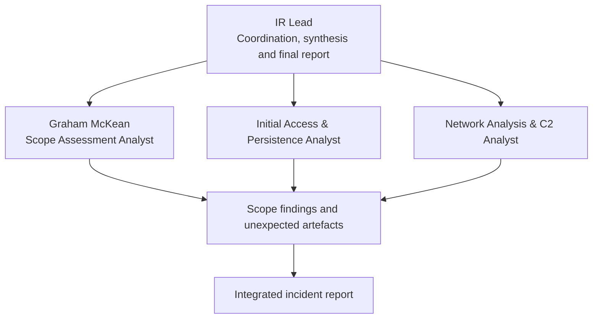
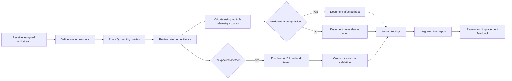
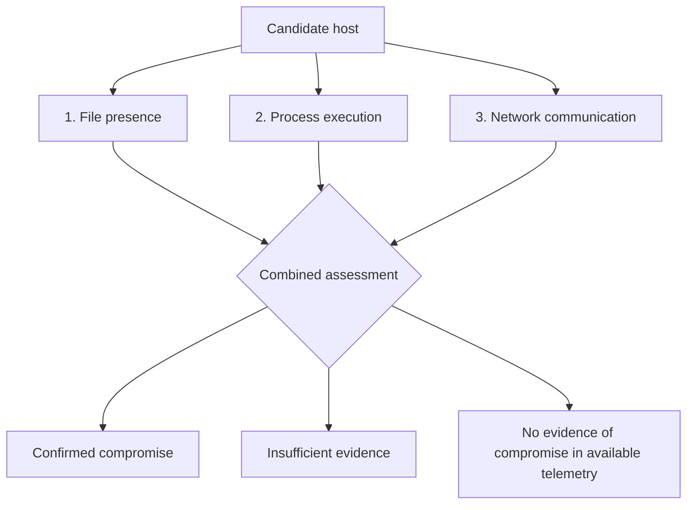
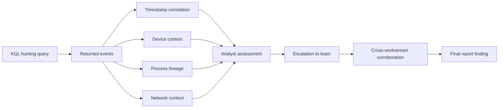
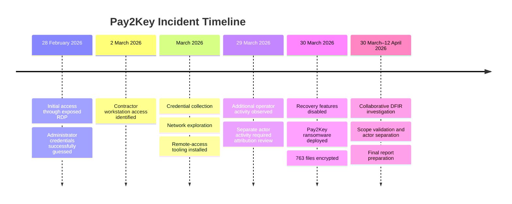
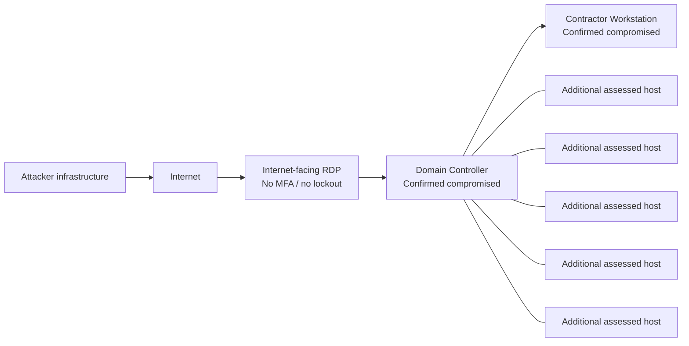
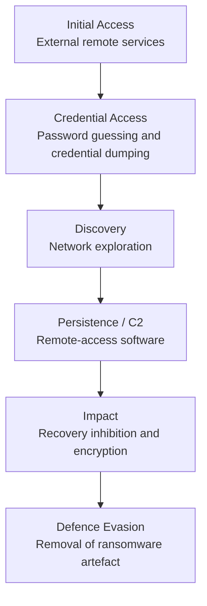

# Pay2Key Ransomware Investigation
## Scope Assessment Analyst Portfolio — Graham McKean

[](#project-overview)
[](#my-role)
[](#tools-and-technologies)
[](#tools-and-technologies)
[](#incident-summary)
[](#portfolio-purpose)

> **Portfolio purpose:** This repository documents my individual contribution to a collaborative Digital Forensics and Incident Response investigation. It does not claim that I conducted the full investigation independently. My assigned responsibility was **scope assessment**, and my findings were combined with the work of other analysts to support the final incident report.

---

## Navigation

- [Portfolio Purpose](#portfolio-purpose)
- [Project Overview](#project-overview)
- [Incident Summary](#incident-summary)
- [My Role](#my-role)
- [Team Structure](#team-structure)
- [Investigation Workflow](#investigation-workflow)
- [Scope Assessment Methodology](#scope-assessment-methodology)
- [Key Findings](#key-findings)
- [Synaptics.exe and massscan_gui.exe](#independent-findings-synapticsexe-and-massscan_guiexe)
- [Evidence Flow](#evidence-flow)
- [Attack Timeline](#attack-timeline)
- [Network Layout](#network-layout)
- [MITRE ATT&CK Mapping](#mitre-attck-mapping)
- [Report Improvement Contribution](#report-improvement-contribution)
- [Technical Skills](#technical-skills-demonstrated)
- [Professional Skills](#professional-skills-demonstrated)
- [Feedback and Development](#feedback-and-development)
- [Screenshots and Evidence](#screenshots-and-evidence)
- [Lessons Learned](#lessons-learned)
- [Repository Structure](#recommended-repository-structure)
- [Interview Talking Points](#interview-talking-points)
- [Ethics and Disclosure](#ethics-and-disclosure)

---

## Portfolio Purpose

This case study is designed to demonstrate how I contributed to a professional-style, team-based cyber investigation. It focuses on:

- Ownership of a defined investigative workstream.
- Evidence-based incident scoping.
- Collaboration with analysts responsible for other phases of the investigation.
- Escalation of unexpected findings.
- Clear communication of technical findings.
- Contribution to a final client-ready incident report.
- Reflection on feedback and continuous improvement.

The investigation was conducted as part of the **MYDFIR SOC Simulation Lab** and involved a Pay2Key ransomware incident. The final team investigation produced a detailed incident response report supported by multiple evidence items, KQL queries, detections and threat-actor separation.

---

## Project Overview

| Item | Detail |
|---|---|
| Case | IR-2026-001 |
| Incident | Pay2Key ransomware |
| Investigation period | 30 March–12 April 2026 |
| Environment | Simulated enterprise environment |
| Investigation model | Collaborative, role-based DFIR investigation |
| My role | Scope Assessment Analyst |
| Primary platform | Microsoft Defender XDR |
| Primary query language | Kusto Query Language |
| Main deliverables | Scope findings, supporting evidence and report feedback |

### Investigation Objectives

The team investigation aimed to:

1. Determine how the attacker entered the environment.
2. Identify affected systems.
3. establish the duration of attacker access.
4. separate activity associated with different threat actors.
5. assess the business impact.
6. recommend containment, recovery and long-term improvements.
7. produce a report suitable for both technical and non-technical stakeholders.

---

## Incident Summary

The incident involved an attacker gaining access through an internet-exposed Remote Desktop Protocol service that lacked multi-factor authentication and account lockout protections.

The investigation determined that:

- Initial access occurred on **28 February 2026**.
- The attacker remained undetected for approximately **30 days**.
- The attacker collected credentials, explored the network and installed remote-access tooling.
- On **30 March 2026**, ransomware was deployed against a contractor workstation.
- **763 files** were encrypted.
- Two systems were confirmed as compromised.
- Five additional systems showed no evidence of compromise.
- Existing security tools generated suspicious-activity alerts, but those alerts were not reviewed or acted upon.
- Data theft was not proven, but could not be fully ruled out.

> **Business impact:** The contractor workstation became unusable, credentials across the environment had to be treated as potentially exposed, and the risk of recurrence remained high until remediation was completed.

---

## My Role

I worked as the **Scope Assessment Analyst**.

My role was not to perform the entire investigation. Instead, I was responsible for one critical workstream: determining the extent of compromise and establishing which systems were affected or unaffected.

### My Responsibilities

- Validate the scope of compromise.
- Correlate evidence across multiple telemetry sources.
- Confirm whether suspicious artefacts were present on candidate systems.
- Determine whether those artefacts had executed.
- Check whether systems communicated with known or suspected attacker infrastructure.
- Distinguish confirmed compromise from unsupported assumptions.
- Share findings with the wider investigation team.
- Escalate unexpected artefacts found during analysis.
- Review the final client-facing report and provide feedback for improvement.

### Why Scope Assessment Matters

Incident scoping affects almost every subsequent decision:

- Which systems must be isolated.
- Which systems must be rebuilt.
- Which accounts must be reset.
- Whether the attacker moved laterally.
- Whether the organisation can safely restore services.
- Whether the incident is contained.
- Whether unrelated malicious activity has been incorrectly attributed.

A weak scope assessment can either miss compromised hosts or unnecessarily expand the response. My aim was to support defensible conclusions using multiple forms of evidence.

---

## Team Structure



### Collaborative Working Model

Each analyst owned a separate investigative area. Findings were shared, challenged and incorporated into the combined report.

My contribution depended on the work of others, and their work also benefited from the scope and attribution findings I escalated. This reflects real incident response, where no single analyst sees the entire incident from one data source or one investigative perspective.

---

## Investigation Workflow



---

## Scope Assessment Methodology

The IR Lead described my methodology as a three-check approach. I assessed candidate systems using:

| Validation Check | Question Answered | Example Evidence |
|---|---|---|
| File presence | Was the suspicious file present on disk? | File events, file path, hash, creation time |
| Process execution | Did the suspicious file run? | Process creation, parent process, command line, user |
| Network communication | Did the system communicate with attacker infrastructure? | Remote IP, port, initiating process, timestamp |

### Three-Source Validation Model



### Analytical Principle

> A host should not be called compromised or clean on the basis of a single query result. Conclusions should be supported by correlated evidence and clearly state the limits of the available telemetry.

---

## Key Findings

### Scope Outcome

| Scope Result | Finding |
|---|---|
| Confirmed compromised systems | 2 |
| Additional systems assessed | 5 |
| Additional systems with evidence of compromise | 0 |
| Files encrypted | 763 |
| Credential risk | All credentials treated as potentially exposed |
| Overall residual risk | High until remediation |

The two compromised systems were:

1. **Domain Controller** — used for network access, control and credential collection.
2. **Contractor Workstation** — used for ransomware deployment and file encryption.

Five additional systems were assessed and showed no evidence of compromise in the available telemetry.

### Confidence Statement

The assessment did not rely solely on an absence of alerts. It considered evidence across disk, execution and network telemetry. This strengthened the reliability of the scope conclusion while still recognising that “no evidence found” is not the same as proving that activity was impossible.

---

## Independent Findings: Synaptics.exe and massscan_gui.exe

During review of hunting results on the contractor workstation, I identified two anomalous executables:

- `Synaptics.exe`
- `massscan_gui.exe`

These artefacts were not the specific focus of my assigned scope-assessment task. I identified them because I reviewed the returned evidence rather than limiting analysis to only the artefacts I expected to find.

### Why This Mattered

The findings were escalated for wider investigation and contributed to the separation of **Actor 3** from the primary Pay2Key activity.

Without that separation, unrelated malicious activity could have been attributed to the ransomware operator, reducing the accuracy of the final report.

### Analytical Significance

| Observation | Significance |
|---|---|
| Unexpected executable names appeared in scope-assessment results | Required investigation beyond the original query objective |
| Artefacts were found on the contractor workstation | Linked the discovery to an already affected system |
| Activity did not fit the expected Pay2Key pattern | Suggested separate tooling or actor activity |
| Findings were shared with the team | Enabled cross-workstream validation |
| Actor 3 was separated in the final report | Improved attribution accuracy |

### Recruiter-Relevant Behaviours Demonstrated

- Curiosity beyond the immediate task.
- Careful review of query output.
- Willingness to challenge initial assumptions.
- Escalation of findings rather than silent interpretation.
- Understanding that attribution requires corroboration.
- Contribution to a team outcome beyond assigned minimum requirements.

> **Screenshot placeholder — Synaptics.exe**  
> Add an annotated Microsoft Defender XDR screenshot showing the relevant process, file or device event.  
> Annotation should identify the timestamp, device, file path, parent process and why the artefact was anomalous.

> **Screenshot placeholder — massscan_gui.exe**  
> Add an annotated Microsoft Defender XDR screenshot showing the relevant process or file event.  
> Annotation should identify the execution context, device, associated user and why the result required escalation.

---

## Evidence Flow



---

## Attack Timeline



> **Timeline image placeholder:** Export the Mermaid timeline as PNG or SVG for use in PDF, LinkedIn and portfolio documents where Mermaid is not rendered.

---

## Network Layout

The source material identifies seven assessed systems, including a Domain Controller and contractor workstation. The exact names and topology of the remaining systems were not provided in the supplied client-facing report, so the diagram below deliberately avoids inventing unsupported host details.



> **Network diagram placeholder:** Replace generic host labels only when authorised source evidence is available.

---

## MITRE ATT&CK Mapping

The following mapping is based only on behaviours described in the supplied incident report. Technique identifiers should be verified against the organisation's preferred ATT&CK version before formal publication.

| Observed Behaviour | Likely ATT&CK Area | Portfolio Interpretation |
|---|---|---|
| Internet-exposed RDP used for access | External Remote Services | Initial access through remote access infrastructure |
| Repeated login attempts | Brute Force / Password Guessing | Weak authentication controls enabled credential compromise |
| Passwords extracted from memory | OS Credential Dumping | Credentials were collected after access |
| Remote-access software installed | Remote Access Software | Attacker maintained continued control |
| Network explored for other systems | Network Service Discovery | Environment reconnaissance and lateral movement preparation |
| Recovery features disabled | Inhibit System Recovery | Reduced the organisation's ability to restore systems |
| Files encrypted | Data Encrypted for Impact | Primary ransomware impact |
| Malicious file removed after execution | Indicator Removal | Reduced directly observable artefacts |



---

## Report Improvement Contribution

In addition to my analytical work, I provided feedback to improve the final report for a client audience.

### Improvement Areas

- Clearer executive language.
- Reduced technical ambiguity.
- Better separation of findings, impact and recommendations.
- Improved flow between the attack narrative and business consequences.
- More accessible explanations for non-technical stakeholders.
- Actionable remediation organised by urgency.
- Clear acknowledgment of uncertainty around possible data theft.

### Client-Ready Reporting Structure

| Report Element | Purpose |
|---|---|
| Incident overview | Explain what happened without unnecessary technical detail |
| Key findings | Present decision-relevant facts |
| Scope of impact | Identify affected systems and business consequences |
| Root cause | Explain the control failures that enabled the incident |
| Detection gaps | Show where monitoring and response failed |
| Risk assessment | Explain residual risk |
| Recommendations | Prioritise immediate, short-term and long-term action |
| Recovery summary | Give stakeholders a practical restoration path |

### Example of Technical-to-Business Translation

| Technical Finding | Business-Focused Interpretation |
|---|---|
| RDP exposed directly to the internet | Remote access could be attacked from anywhere |
| No MFA | A guessed password was enough to gain access |
| No account lockout | Repeated password attempts were not stopped |
| Alerts were generated but not investigated | Existing security tools detected activity, but operational response failed |
| Credentials were collected | All passwords should be treated as potentially exposed |
| Recovery features were disabled | Restoration became harder and slower |

---

## Technical Skills Demonstrated

| Skill | Evidence from Project |
|---|---|
| Microsoft Defender XDR | Used endpoint and network telemetry during scope assessment |
| Kusto Query Language | Used hunting queries to identify and validate artefacts |
| Incident scoping | Distinguished affected from unaffected assets |
| Evidence correlation | Combined file, process and network evidence |
| Threat hunting | Reviewed results for expected and unexpected activity |
| Ransomware investigation | Assessed activity linked to Pay2Key deployment |
| Threat attribution support | Contributed findings that separated Actor 3 |
| Technical reporting | Submitted findings for integration into the final report |
| Executive reporting | Helped improve the client-ready report |

---

## Professional Skills Demonstrated

### Collaboration

I worked as one member of a multi-analyst investigation. I had to understand where my responsibilities began and ended, while also recognising when my findings affected another analyst's workstream.

### Ownership

I was responsible for producing a defensible scope assessment rather than waiting for the IR Lead to make host-by-host determinations.

### Communication

Findings had to be described clearly enough that other analysts could validate and use them.

### Initiative

The discovery of `Synaptics.exe` and `massscan_gui.exe` resulted from reading the returned data carefully rather than treating queries as simple pass-or-fail checks.

### Critical Thinking

I considered whether evidence fit the expected Pay2Key activity and escalated artefacts that did not.

### Attention to Detail

Accurate scope and attribution depended on timestamps, processes, devices, paths and network context being interpreted together.

### Constructive Review

I contributed feedback intended to improve the usefulness of the final client-facing report.

### Continuous Improvement

The IR Lead's feedback identified documentation polish as an area for development. I have used that feedback to structure this portfolio around clarity, standalone explanations and evidence-led conclusions.

---

## Feedback and Development

### Positive Feedback

The IR Lead described the scope assessment as methodical and highlighted the three-check methodology as a strong example of proving findings across multiple data sources.

The identification of `Synaptics.exe` and `massscan_gui.exe` was recognised as a significant contribution because it helped prevent incorrect attribution of Actor 3 activity to Pay2Key.

### Development Area

The main improvement point was ensuring that the quality of the first written submission matched the quality of the analysis.

For future investigations, I would:

1. Conduct a dedicated peer-style review before submission.
2. Ensure every query has a clear purpose and explanation.
3. Define abbreviations and technical terms on first use.
4. Confirm that each finding stands alone for a reader outside the investigation.
5. Separate observation, interpretation, confidence and recommendation.
6. Standardise formatting before final submission.

---

## Screenshots and Evidence

The supplied attachments did not contain the original Microsoft Defender XDR screenshots or raw KQL output. To avoid fabricating evidence, the locations below are intentional placeholders.

### Recommended Screenshot Format

Each screenshot should include four callouts:

1. **Observation** — what appears in the evidence.
2. **Context** — device, timestamp, user and query source.
3. **Why it matters** — relevance to scope or attribution.
4. **Conclusion** — what can and cannot be stated from the evidence.

<details>
<summary><strong>Screenshot 1 — Scope query result</strong></summary>

**Required image:** Microsoft Defender XDR Advanced Hunting result showing one assessed host.

**Required annotations:**

- Device name.
- Event timestamp.
- File or process name.
- Relevant path.
- Network destination, where applicable.
- A note explaining whether the result supports compromise, non-compromise or requires further investigation.

**Suggested filename:** `images/scope-query-result.png`

</details>

<details>
<summary><strong>Screenshot 2 — Synaptics.exe</strong></summary>

**Required image:** Relevant Defender event showing `Synaptics.exe`.

**Required annotations:**

- Device: contractor workstation.
- Timestamp.
- File path.
- Parent process.
- User or session context.
- Why the artefact did not fit expected Pay2Key activity.
- Escalation note: contributed to Actor 3 separation.

**Suggested filename:** `images/synaptics-finding.png`

</details>

<details>
<summary><strong>Screenshot 3 — massscan_gui.exe</strong></summary>

**Required image:** Relevant Defender event showing `massscan_gui.exe`.

**Required annotations:**

- Device: contractor workstation.
- Timestamp.
- File path.
- Process execution or file-presence evidence.
- Related network activity, where available.
- Why the artefact required escalation.
- Escalation note: contributed to Actor 3 separation.

**Suggested filename:** `images/massscan-gui-finding.png`

</details>

<details>
<summary><strong>Screenshot 4 — Three-source validation</strong></summary>

**Required images:** A combined or three-panel view showing:

- File presence.
- Process execution.
- Network communication.

**Suggested filename:** `images/three-source-validation.png`

</details>

---

## Example Evidence Table

| Evidence ID | Device | Evidence Type | Artefact | Observation | Assessment |
|---|---|---|---|---|---|
| GM-001 | Contractor workstation | File / process | Synaptics.exe | Unexpected executable identified during hunting | Escalated for actor-separation analysis |
| GM-002 | Contractor workstation | File / process | massscan_gui.exe | Unexpected scanning-related executable identified | Escalated for actor-separation analysis |
| GM-003 | Domain Controller | Multi-source | Pay2Key-related activity | File, process or network evidence supported compromise | Confirmed compromised |
| GM-004 | Additional systems | Multi-source | No corroborated activity | No evidence identified in available telemetry | No evidence of compromise |

> Replace generic entries with authorised timestamps, hashes, paths and query references before public release.

---

## Lessons Learned

### Technical

- Scope conclusions should be based on correlated evidence.
- Absence of evidence must be described carefully.
- Unexpected findings can be as important as expected indicators.
- Attribution should be separated by timestamp, host, tooling and operator context.
- Security alerts only reduce risk when there is a process to investigate them.
- Technical findings should be connected to containment and recovery decisions.

### Professional

- Strong analysis can lose impact if the write-up is unclear.
- Team members should own their workstream while staying alert to wider implications.
- Findings should be escalated early when they affect another analyst's conclusions.
- Constructive report review is part of incident response, not an administrative afterthought.
- A client report must support decisions, not simply display technical detail.

---

## Recommended Repository Structure

```text
pay2key-scope-assessment/
├── README.md
├── LICENSE
├── .gitignore
├── docs/
│   ├── portfolio.pdf
│   ├── executive-summary.md
│   └── methodology.md
├── images/
│   ├── network-layout.svg
│   ├── attack-timeline.svg
│   ├── investigation-workflow.svg
│   ├── evidence-flow.svg
│   ├── mitre-mapping.svg
│   ├── synaptics-finding.png
│   ├── massscan-gui-finding.png
│   └── three-source-validation.png
├── queries/
│   ├── README.md
│   ├── scope-assessment.kql
│   └── validation-queries.kql
├── evidence/
│   ├── evidence-register-template.csv
│   └── scope-matrix-template.csv
└── reports/
    └── client-ready-summary.md
```

---

## Interview Talking Points

### “What was your role?”

I was the Scope Assessment Analyst within a collaborative ransomware investigation. I owned the workstream responsible for determining which systems were affected and validating that conclusion across file, process and network telemetry.

### “Did you investigate the whole incident?”

No. The investigation was intentionally divided between analysts. My responsibility was scope assessment, while other team members investigated initial access, persistence, network activity and command-and-control. We combined our findings into a single final report.

### “What was your most important contribution?”

While reviewing scope-assessment results, I identified `Synaptics.exe` and `massscan_gui.exe` on the contractor workstation. Those artefacts were outside the immediate question I had been assigned, but they did not fit the expected Pay2Key activity. Escalating them helped the team separate Actor 3 and avoid incorrect attribution.

### “What did you learn?”

I learned that good incident response depends on both technical accuracy and clear communication. My analysis was positively reviewed, but I was advised to improve the polish of first-draft submissions. I have used that feedback to improve structure, clarity and standalone explanations.

### “What soft skills did you demonstrate?”

Collaboration, ownership, initiative, analytical thinking, evidence-based decision-making, attention to detail, technical communication, constructive review and continuous improvement.

---

## Ethics and Disclosure

- This repository is a portfolio case study based on a simulated cyber investigation.
- Sensitive or identifying information should be sanitised before publication.
- Screenshots must not expose credentials, tokens, personal data or confidential infrastructure details.
- Hashes, IP addresses and domain names should be defanged where appropriate.
- Placeholder content should not be replaced with invented evidence.
- Any public version should clearly distinguish observed evidence from analyst interpretation.

---

## Author

**Graham McKean**  
Scope Assessment Analyst  
Cybersecurity | SOC Analysis | DFIR | Threat Hunting | Incident Response

---

## Acknowledgement

This was a collaborative investigation. The final outcome reflected contributions from the IR Lead and analysts responsible for scope assessment, initial access, persistence, network analysis and command-and-control investigation.
